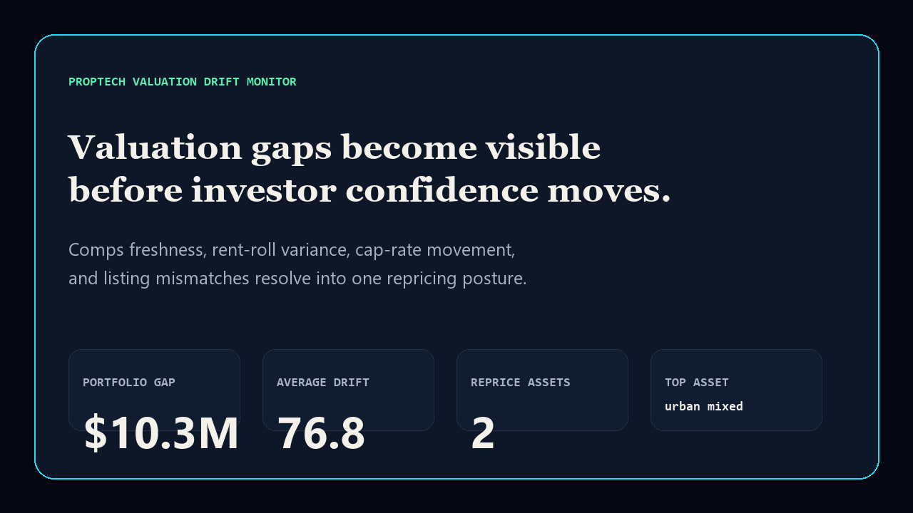
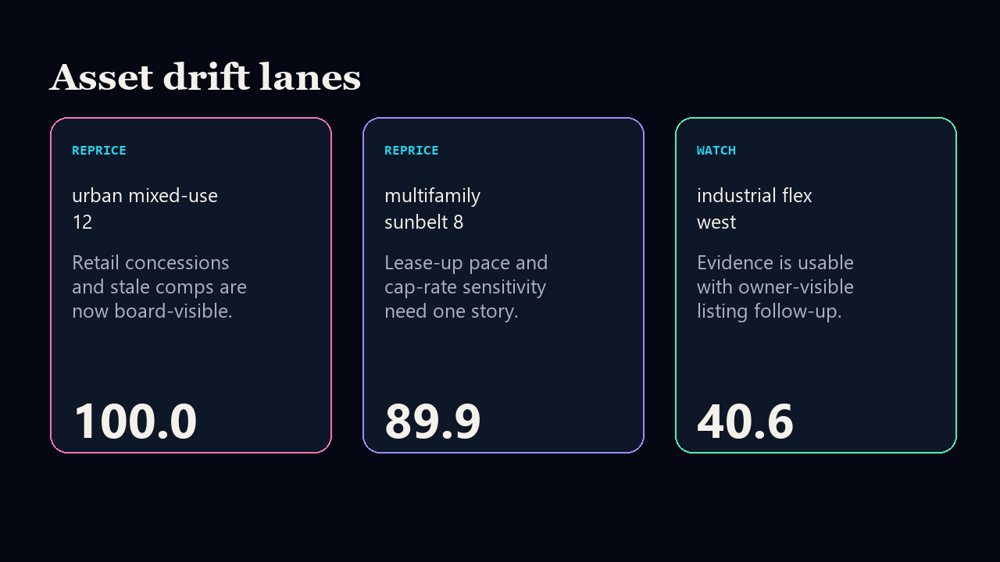

# proptech-valuation-drift-monitor

[](https://github.com/mizcausevic-dev/proptech-valuation-drift-monitor/actions/workflows/ci.yml)
[](https://github.com/mizcausevic-dev/proptech-valuation-drift-monitor/actions/workflows/pages.yml)
[](LICENSE)

Board-readable PropTech valuation drift monitor for comps freshness, rent-roll variance, cap-rate movement, listing mismatches, and repricing posture.

## Why this exists

- Real-estate valuation risk hides when comps, listing systems, rent rolls, and investor packets drift separately.
- Portfolio leaders need one evidence lane before lender confidence, investor updates, or acquisition marks move.
- Recruiters and buyers looking for `PropTech / valuation / SQL / Python / TypeScript` proof should see a real operator surface, not a keyword page.

## What it shows

- TypeScript scoring engine for asset-level valuation drift posture.
- Python mirror for portfolio analytics review.
- SQL source contract for reviewed valuation evidence fields.
- Static GitHub Pages proof surface and screenshot package.

## Screenshots





## Local run

```bash
npm install
npm run verify
npm run prerender
```

## CLI

```bash
npx tsx src/cli.ts fixtures/valuation-drift.json
npx tsx src/cli.ts fixtures/valuation-drift.json --format=json
```

## Kinetic Gain fit

This repo extends the PropTech lane of Kinetic Gain: valuation evidence, access/listing drift, and investor-facing proof resolve into one board-readable control surface.
